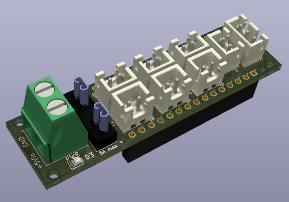
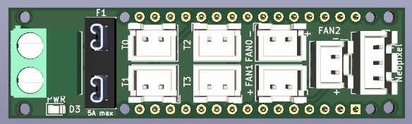
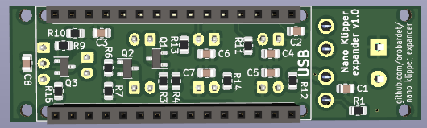
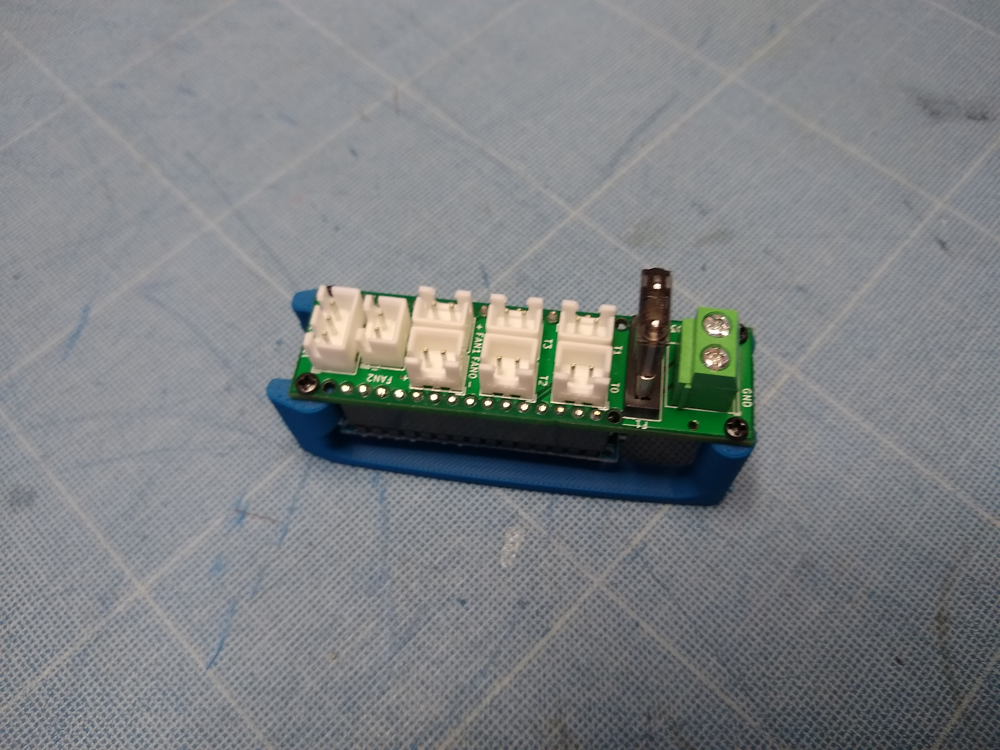

# Klipper Nano Expander

An Arduino Nano Shield to use with Klipper 3D printer firmware, as a auxiliary MCU.

## Features

- Only require an Arduino Nano
- +5V optionnal external power supply with fuse
  - Connected to the Arduino Nano 5V
  - Only required if you need more than 500mA power, else the Nano power supply should be enough
- x4 temperature sensors (or any analog device as input)
- x3 PWM mosfet driven port (or any PWM controlled device as output)
- x1 Neopixel (external 5V power supply needed)

  

- [Schematic](Schematic.pdf)
- [Mechanical drawing](Dimensions.pdf)

Source files:
- Kicad 6 project, schematic, PCB and library
- [CAD files](CAD/), including .STEP and Fusion 360 source

## Why

- Adds more temperature sensors and fan controllers
- Drives 5V fans
- Drives a 5V Neopixel without a level shifter
- Arduino nano are cheap
- Arduino nano are easy to source
- A lot of people (including me) have some in their drawers
- This board only have simple components easy to find
- Small footprint
- Does not need any hardware interaction to flash (no boot jumper or boot button to press)

## How to build

[production directory](production/) contains Gerber file and BOM + Position file for JLCPCB assembly.

If you use JLC PCB to produce and assemble your board, configure PCBA for the bottom side, where most of the SMD
component are placed.  
You'll have to solder by yourself the power indicator LED on the front of the board. It's a 0805, that can be soldered by hand.  
However this LED is not mandatory for the board to work, you can skip soldering it if you want.  
You'll also have to source and solder all the other non-SMD components:
- x2 15 pins female dupont header for the Arduino Nano (or directly the male pin of the Nano, which is not recommended)
- x1 [Keystone 3544-2 mini fuse holder](https://www.digikey.com/en/products/detail/keystone-electronics/3544-2/316029)
- x7 2 pins JST connector (FANx and THx headers)
- x1 3 pins JST connector (Neopixel headers)
- x1 screw terminal pitch 2.54 for power in

### BOM

- [Interactive BOM](http://htmlpreview.github.io/?https://github.com/orobardet/klipper_nano_expander/blob/master/interactive_bom/klipper_nano_expander_interactive_bom.html)
- [CSV](Klipper_nano_expander-BOM.csv) or [XLSX](Klipper_nano_expander-BOM.xlsx) BOM

Ref                | Qty | Value          | Description                                              | Soldering     | Footprint         | LCSC Ref
-------------------|-----|----------------|----------------------------------------------------------|---------------|-------------------|------------
C1, C8             |   2 | 10uF	          | Unpolarized ceramic capacitor                            | PCBA          | 0805              | [C17024](https://lcsc.com/product-detail/Multilayer-Ceramic-Capacitors-MLCC-SMD-SMT_Samsung-Electro-Mechanics-CL21A106KPFNNNE_C17024.html)
C2, C3             |   2 | 0.1uF          | Unpolarized ceramic capacitor                            | PCBA          | 0805              | [C49678](https://lcsc.com/product-detail/Multilayer-Ceramic-Capacitors-MLCC-SMD-SMT_YAGEO-CC0805KRX7R9BB104_C49678.html)
C4, C5, C6, C7     |   4 | 4.7uF          | Unpolarized ceramic capacitor                            | PCBA          | 0805              | [C1779](https://lcsc.com/product-detail/Multilayer-Ceramic-Capacitors-MLCC-SMD-SMT_Samsung-Electro-Mechanics-CL21A475KAQNNNE_C1779.html)
Q1, Q2, Q3         |   3 | IRLML6344TRPBF | MOSFET N-CH 30V 5A SOT23                                 | PCBA          | SOT-23            | [C20917](https://lcsc.com/product-detail/MOSFETs_Alpha-Omega-Semicon-AO3400A_C20917.html)
R1                 |   1 | 1K             | Resistor                                                 | PCBA          | 0805              | [C17513](https://lcsc.com/product-detail/Chip-Resistor-Surface-Mount_UNI-ROYAL-Uniroyal-Elec-0805W8F1001T5E_C17513.html)
R3, R6, R9, R15    |   4 | 100            | Resistor                                                 | PCBA          | 0805              | [C17408](https://lcsc.com/product-detail/Chip-Resistor-Surface-Mount_UNI-ROYAL-Uniroyal-Elec-0805W8F1000T5E_C17408.html)
R4, R7, R10        |   3 | 10K            | Resistor                                                 | PCBA          | 0805              | [C17414](https://lcsc.com/product-detail/Chip-Resistor-Surface-Mount_UNI-ROYAL-Uniroyal-Elec-0805W8F1002T5E_C17414.html)
R11, R12, R13, R14 |   4 | 4.7K           | Resistor                                                 | PCBA          | 0805              | [C17673](https://lcsc.com/product-detail/Chip-Resistor-Surface-Mount_UNI-ROYAL-Uniroyal-Elec-0805W8F4701T5E_C17673.html)
D3                 |   1 | Any color      | LED                                                      | PCBA          | 0805              | [C84256](https://lcsc.com/product-detail/Light-Emitting-Diodes-LED_Foshan-NationStar-Optoelectronics-NCD0805R1_C84256.html)
A1                 |   1 |                | Arduino Nano v3.x                                        | Hand-soldered |                   |
A1-a, A1-b         |   2 |                | 15 pins female dupont header + 15 mins mal dupont header | Hand-soldered | P2.54             |
F1                 |   1 | Fuse           | Mini fuse holder + 2A or 5A mini fuse                    | Hand-soldered | 3544-2_FuseHolder | 	
J1                 |   1 |                | Screw terminal 2 pins P5.08mm                            | Hand-soldered | P5.08mm           | 
FAN0, FAN1, FAN2   |   3 |                | JST 2 pins P2.54mm                                       | Hand-soldered | P2.54             | 
T0, T1, T2, T3     |   4 |                | JST 2 pins P2.54mm                                       | Hand-soldered | P2.54             | 
Neopixel           |   1 |                | JST 3 pins P2.54mm                                       | Hand-soldered | P2.54             | 

## How to use

**ONLY** use **5V** power supply! The Vin of the bord is connected to the 5V of the Arduino Nano, with no protection:  
any power >5V may fry your Nano, and any power <5V may fry you power supply.

Powering on Vin with an external 5V power supply is only necessary if you device draw more current than the Nano can provide (800mA theorically, 
but with so many Nano clone out there it's safer to stick to 500mA max).
- If you only plug temperature sensors, the Nano power supply should be enough
- If you drive a fan, I'd better power the board with external power supply (most fan draws more then 500mA when they start)
- If you drive an neopixel, **powering the board with external power supply is highly recommended**

In doubt, power the board. You should already have a 5V power source if you use Klipper, to power the Pi.

FANx header are mosfet PWM output, driving the ground:
- You can use them for anything else than FAN, like LED, heater, etc. Just stick to 1A per output max.
- If the fan or whatever you drive is not 5V, just connect its ground to the Klipper Nano Expander, and its +V to any compatible power source, **but ensure that other PSU's ground is connected to the board ground!**.

### Software configuration

Once built and connected to your Klipper host, use the provided [Klipper config file](config/nano_klipper_expander.cfg).

Here is the pin mapping for reference:
- TH0: PC0
- TH1: PC1
- TH2: PC2
- TH3: PC3
- FAN0: PB1
- FAN1: PD5
- FAN2: PD3
- Neopixel Data: PD6

### Mounting

x2 3D printable mounts are provided (STL files):
- [without mounting holes](STL/nano_expander_mount.stl): lower footprint, but require some tape (like VHB tape) to secure the mount on a flat surface.
- [with mounting holes](STL/nano_expander_mount_with_holes.stl): a wider mount with 4 mounting holes, to secure the mount with M3 screws. Screws position and distance can be found in [dimension drawing](Dimensions.pdf).

Both mounts require x4 M2x3mm screw to secure the board to the mount.

## Credit

Inspired by [STM32-Klipper-Expander](https://github.com/VoronDesign/Voron-Hardware/tree/master/Klipper_Expander) by Voron Design Team.  
Temperature sensors and FAN output of Klipper Nano Expander are a copy of those of STM32-Klipper-Expander.